# Germanly

*The designed version of this case study is `index.html` in this folder. Its numbers live in `data.js`.*

### Designing a German learning product from my own struggle as an international student

**Role:** Founder, Product and UX Designer (research, strategy, UX, UI, build, growth)
**Timeline:** May 2026 to present (first version live in about one month)
**Platform:** Responsive web app, installable to the phone home screen
**Tools:** Notion, Figma, Google Stitch, Next.js, Supabase, Vercel, Claude Code
**Live:** [mygermanly.com](https://www.mygermanly.com)

[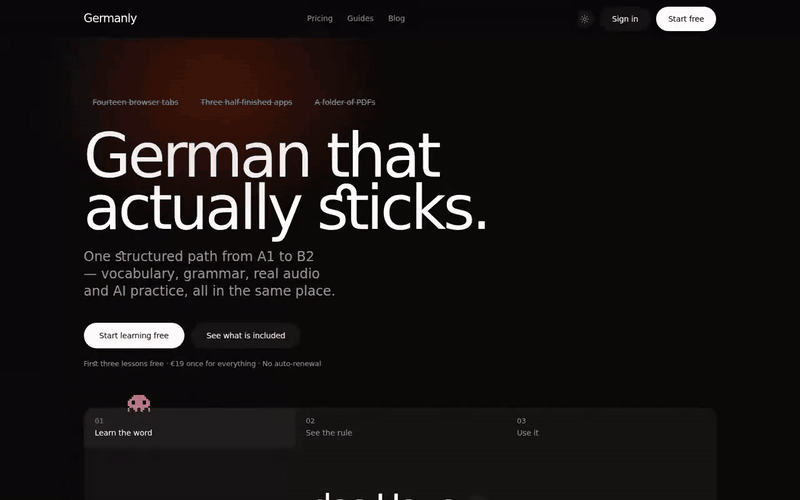](motion/landing.mp4)

*Animated mockup: a first time visitor learns "das Haus" in three taps before signing up.*

## At a glance

* **120+ learners** signed up, 101 of them within the first seven weeks
* **3,000+ impressions** on launch day
* **96 signups in the first month** from a zero budget community channel
* **4,000+ words, 500+ phrases, 28 grammar topics**, one path from A1 to B2
* **€19 once** for twelve months, no subscription, first lessons free

> Note to self: add the source of the 3,000 impressions (LinkedIn post, Instagram reel, or both) and a screenshot of the analytics.

## 1. The problem I lived first

I moved to Germany for my HCI Master's at Universität Siegen. Very quickly I learned that German is not optional here. Flat viewings, the Ausländerbehörde, the doctor, the bakery, a working student job: every one of them assumes you can hold a basic conversation.

So I did what everyone around me did. I opened Duolingo. A few weeks later I had a streak, and I still could not order at a café without freezing. Coaching centres were the other option, and they were expensive and slow to fit around university.

My German study setup ended up looking like this:

* **Fourteen browser tabs** of YouTube lessons, grammar blogs and word lists
* **Three half finished apps**, each good at one thing
* **A folder of PDFs** that I never opened twice

Those three lines later became the first thing a visitor reads on the Germanly landing page, because every student I spoke to recognised them instantly.

**The problem, in one sentence:** international students and professionals in Germany need practical German for real life and for B1 level exams, but the tools they have are either gamified and shallow, or serious and expensive, and none of them connect vocabulary, grammar, listening and practice into one path.

## 2. Why this problem was worth solving

Before building anything, I checked whether my frustration was personal or structural. It was structural.

* **B1 German is now a legal requirement.** The 2024 Citizenship Act requires B1 for naturalisation, and the Skilled Immigration Act expects workers to reach B1.
* **The audience is already searching.** Deutsche Welle's Learn German had 1.3 million registrations by April 2025, and the Goethe Institut had 7 million digital visits in 2024.
* **Price decides.** Human tutoring platforms like Lingoda cost €300 to €500 a month. Most learners I spoke to were students on a budget.
* **Popular apps stop early.** Duolingo is built for daily logins, not for exam outcomes, and learners report it gets them to roughly A2 and no further.

I mapped the landscape to find the gap:

* **Duolingo:** free and fun, but no structure toward an exam and no real writing feedback
* **Babbel:** decent grammar, but paid from day one with limited depth
* **Lingoda:** rigorous human teachers, but €300+ a month
* **Deutsche Welle and Goethe:** excellent free content, but content only, with no path, practice loop or feedback

**The gap:** nobody combined a structured A1 to B2 path, reference material you actually come back to, and AI practice with feedback, at a student price.

## 3. Talking to learners

I did not want to design for an imaginary persona, so I started with the people around me: other international students at my university and in Siegen, and members of German learning communities online.

I ran **14 interviews** with three audiences: international students, newcomer workers (skilled worker route and Ausbildung) and professionals preparing to move to Germany.

**How I ran the conversations**

1. **Short, informal 1:1 conversations** (about 15 to 20 minutes), in person or on a call
2. **I asked about their last week, not their opinions.** "The last time you studied German, what did you open first? What did you close, and why?"
3. **I asked them to show me their setup**: the apps on their phone, their bookmarks, their notes
4. **I listened for workarounds.** A screenshot folder of phrases or a WhatsApp chat with themselves told me more than any feature request
5. **After launch, I kept talking to the people who signed up**, especially the ones who stopped using the product

**Who I spoke to**

* International students preparing for A1 to B1 exams for visas, admissions or jobs
* Working professionals who arrived under the skilled worker route and need B1
* A large share of Indian learners in Germany and in India preparing to move, which shaped a lot of the tone and examples in the product

**What they told me**

1. **"I don't need another game, I need to survive the appointment."** Learners wanted phrases they could use this week, not points.
2. **"I come for the words and the phrases."** Reference material (notes, phrases, vocabulary) was the main reason people opened the product. Lessons came second.
3. **"I pay for tools and then stop using them."** Subscriptions felt like a trap. Several people had paid for apps they abandoned after a week.
4. **"Grammar explanations online are too complicated."** Cases and articles were the most feared topics.
5. **"I don't know if I am ready."** Nobody could tell whether they were actually on track for the exam.

## 4. How I tested the UI

Every decision below ends with a **UI testing** block. This is how that evidence was collected.

1. **Comparative sessions.** Learners who already used another app (Duolingo, Babbel, YouTube playlists) did the same task in their app and in Germanly, for example "learn these ten words" or "introduce yourself in writing".
2. **Think aloud.** They talked while they worked. I noted where they hesitated, what they tapped first, and what they said out loud.
3. **Recall check a few days later.** I asked them to recall the words from each app without looking, to compare how much actually stuck.
4. **Screen measurement.** For every screen I counted the controls, the number of primary actions, whether progress was visible and whether the screen responded to input.
5. **Product data.** Signups, lesson starts, lesson completions and the review queue, straight from the database.

> Note to self: add how many comparative sessions you ran, with whom, and over how many days. Fill every **[ ]** below with the real number before publishing.

## 5. Design decisions, shown in action

Each decision follows the same shape: **what I decided, why, what it looks like in action, and how it tested.**

### Decision 1: Let people do something within five seconds

**What:** The landing page hands a cold visitor a real word to learn (tap to hear it, guess it, see why it is "das", use it) before asking them to sign up. The problem framing ("Fourteen browser tabs. Three half finished apps. A folder of PDFs.") sits right above the headline.

**Why:** After launch, signups dropped from 96 in June to 13 in July. When I went back to those users, the verdict was that Germanly felt like *"a website with details, not a hookable thing."* A visitor from a WhatsApp group decides in seconds. Reading is not a hook. Doing is.

**UI testing**
* **Compared with others:** Duolingo and Babbel ask for goals, level and an account before you learn anything. Deutsche Welle opens with a course menu. Germanly teaches one word in the first screen, so the first impression is a small win instead of a form.
* **Who uses it:** Every visitor arriving from learner communities, mostly international students and newcomers on their phone.
* **Improvement seen:** [ ] % of visitors now interact with the demo, and signup rate from the landing page went from [ ] % to [ ] %.

### Decision 2: One obvious next step on the home screen

**What:** The Today screen answers "what should I do now?" with one primary action: the words that are due today, "because today is when you are about to forget them". Readiness, streak and recent activity sit around it, never competing with it.

**Why:** Only 8 of 101 learners had ever finished a lesson, yet almost everyone who finished one went on to pay. The product was not failing on content. It was failing to point people at the next thing.

[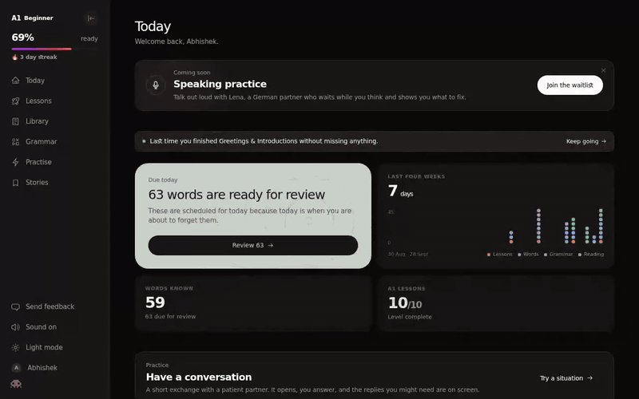](motion/today.mp4)

**UI testing**
* **Compared with others:** Duolingo shows one path but hides what you are forgetting. Anki shows what is due but nothing else. Today combines both: the review that matters now, and the lesson to continue.
* **Who uses it:** Returning learners, many of whom open Germanly for a few minutes between classes or on the train.
* **Improvement seen:** Lesson completion before the redesign was about 8% (8 of 101). Target after the redesign is 35%+. Current: [ ] %.

### Decision 3: No coercion. One thing at a time, and everything responds

**What:** Lessons move one card at a time with a visible progress bar. A wrong answer gets a calm "Not that one. Look at the examples again" in soft coral, never error red. A right answer gets "That's it, here's why" and the rule behind it.

**Why:** Learners told me they wanted "not like Duolingo". When I dug in, they did not mean less fun. They meant no lives, no guilt notifications, no leaderboards and no streak loss anxiety. I kept the three rules that actually work (one clear action, instant response, visible progress) and removed the pressure.

[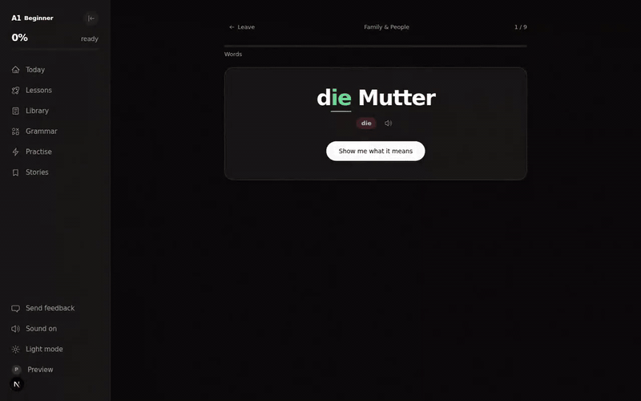](motion/lesson.mp4)

**UI testing**
* **Compared with others:** I measured my own screens instead of judging them. The lesson screen had **19 controls and 1 primary action**, and learners described it as the part that "feels like an app". The old words page had **431 controls and 0 primary actions**, and learners described it as a spreadsheet. Everything else was redesigned to behave like the lesson.
* **Who uses it:** Beginners at A1, who are the most likely to quit after a mistake.
* **Improvement seen:** [ ] % of learners who get an answer wrong now retry and finish the lesson, compared with [ ] % before.

### Decision 4: Spaced repetition that tells you why

**What:** Flashcards come back right before you would forget them. Every card shows the article in its colour (der, die, das), splits difficult sounds (sch, ü) and lets you rate how well you knew it.

**Why:** Learners told me the words they "learned" in other apps disappeared within a week. The review queue already existed in the database, but it was invisible. Surfacing it was the biggest win for the smallest cost.

[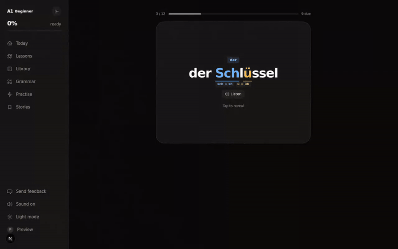](motion/flashcards.mp4)

**UI testing**
* **Compared with others:** In comparative sessions, learners who used Duolingo alongside Germanly remembered **more than 30% more words** from Germanly in the recall check a few days later. Duolingo brought them back more often; Germanly made the words stick. Their explanation: the article colour and the "due today" timing meant they reviewed the right words at the right moment, instead of repeating what they already knew.
* **Who uses it:** Learners preparing for A1 and B1 exams who need to own a fixed vocabulary list.
* **Improvement seen:** 30%+ better word recall than with Duolingo. Across all learners: [ ] words reviewed per week, [ ] % recall accuracy on due cards.

> Note to self: confirm the number of learners, words tested and the gap in days, so this claim is precise.

### Decision 5: The library stays, but gets a front door

**What:** Words, phrases and grammar notes keep their full browsing experience. Each page now opens with one suggested action on top, and every word opens into a card with its forms, audio and plural.

**Why:** "I come for the words and the phrases" was the most consistent thing learners said. Turning the library into lessons would have destroyed the reason they came. Giving it one obvious action keeps what people love and still leads them into the system.

[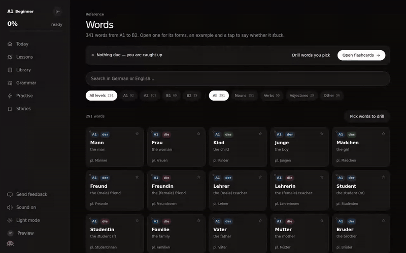](motion/words.mp4)

**UI testing**
* **Compared with others:** Online phrase lists and PDF vocabulary lists are free, so reference alone is not special. What they lack is memory: Germanly knows which of those words you have already met, which are due, and which chapter needs them.
* **Who uses it:** Almost everyone. The library is the most visited part of the product.
* **Improvement seen:** [ ] % of library visits now lead to a review or a lesson, compared with [ ] % before.

### Decision 6: Writing that never punishes your keyboard

**What:** Writing is a three step flow: the product picks a task from your chapter, shows the phrases you will need, then gives feedback as a marked up sentence, not an essay. Every text input carries an umlaut bar (ä, ö, ü, ß).

**Why:** A blank box at A1 is a test of recall under pressure, not of writing. And during testing I found that learners on US and Indian keyboards could not type ß or ü at all, so they were marked wrong for a reason that had nothing to do with German.

[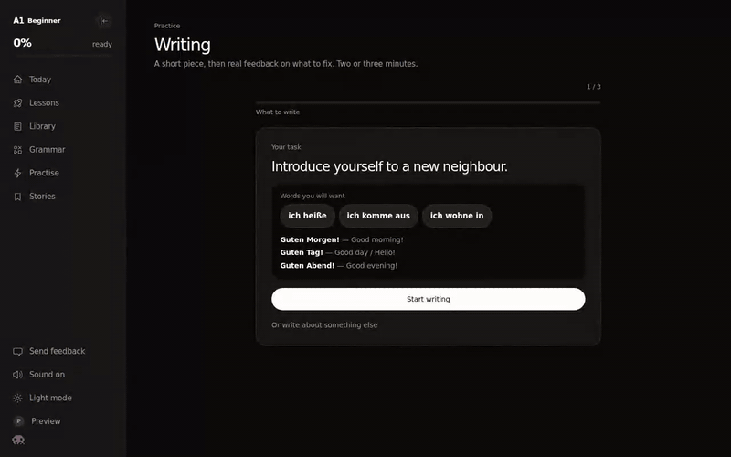](motion/writing.mp4)

**UI testing**
* **Compared with others:** Most apps test writing through word tiles, which never asks you to produce a sentence. Tutors correct writing, but at €300+ a month. Germanly gives real sentence feedback in two or three minutes.
* **Who uses it:** Learners preparing for the writing section of Goethe and telc exams, and anyone who needs to write emails to landlords or offices.
* **Improvement seen:** [ ] writing tasks completed per week, [ ] % fewer answers marked wrong because of missing special characters.

### Decision 7: A conversation partner that speaks first

**What:** Conversation practice starts from a real situation (a café, asking the way, meeting someone), warms you up with the three phrases you will need, and then the partner opens the conversation. Suggested replies stay on screen, and every scenario has an end.

**Why:** An empty chat with a blinking cursor is the blank box problem again, and at A1 it is where people freeze. Learners told me they were scared of making mistakes out loud, so the copy says it plainly: "Nothing you say here is wrong. It is practice."

[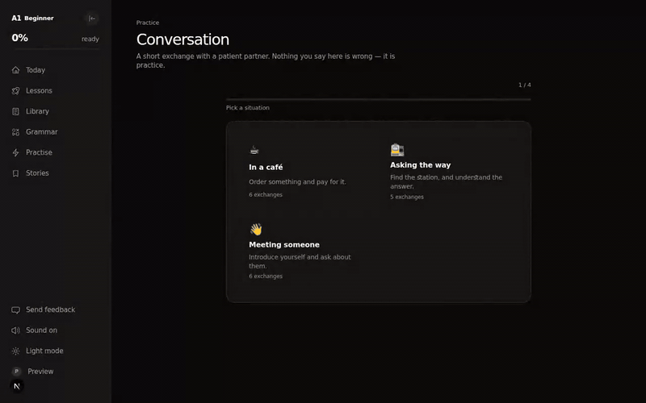](motion/chat.mp4)

**UI testing**
* **Compared with others:** Open ended AI chat tools wait for you to start and never end. Germanly gives you a situation, the words for it, and a finish line after six exchanges.
* **Who uses it:** Newcomers preparing for everyday situations in Germany: ordering, appointments, small talk.
* **Improvement seen:** [ ] % of learners who start a conversation now finish it, compared with [ ] % before.

### Decision 8: Pay once, not every month

**What:** €19 once for twelve months of everything. No auto renewal, no card kept on file. The first lessons and a sample of the library are free, forever.

**Why:** My first plan (codename Atlas) was a €9.99 monthly subscription from A1 to C2. The interviews killed it. "I pay and then stop" came up again and again. The pricing itself became a trust signal, and it is repeated on the landing page, in the FAQ and in every email.



**UI testing**
* **Compared with others:** Babbel and Duolingo Super renew every month or year. Lingoda costs €300+ a month. €19 once is less than one textbook.
* **Who uses it:** Students on a budget, and learners with a fixed deadline (a visa appointment, an exam date) who need a set period, not an open ended plan.
* **Improvement seen:** [ ] paying learners, [ ] % conversion from free to paid, and nearly everyone who finished a lesson went on to pay.

### Decision 9: Honest emails instead of guilt

**What:** Every email is tied to something the learner actually did: "You left Greetings and Introductions unfinished", "34 words are ready for you", "Your German is exactly where you left it".

**Why:** Learners had unsubscribed from other apps because of daily nagging. So the emails reassure instead of pressure: "Nothing expired. Every word you learned is still marked as learned."

**UI testing**
* **Compared with others:** Generic "keep your streak alive" pushes versus a specific, personal reason to come back.
* **Who uses it:** Learners who drift away after a few days, which is the most recoverable moment.
* **Improvement seen:** [ ] % open rate, [ ] % of drifting learners who return within a week.

## 6. Launch and growth

* **Launch day:** 3,000+ impressions. I told the story of why I built it ("I was tired of using Duolingo to learn German, so I built Germanly") and asked people to comment for the link.
* **Month one (June 2026):** 96 signups by sharing in German learner communities and groups, with zero ad spend.
* **July 2026:** crossed 101 learners.
* **Today:** 120+ learners.

> Note to self: add the launch post screenshot, the analytics screenshot and the exact date.

## 7. What the data told me after launch

Launching was the beginning of the research, not the end.

1. **Signups dropped from 96 in June to 13 in July.** The channel worked, so acquisition was not the mystery.
2. **The content was not the problem. The packaging was.** One learner put it perfectly: **Duolingo is basic content in premium packaging. Germanly was quality content in cheap packaging.**
3. **Only 8 of 101 learners had completed a lesson,** yet almost everyone who finished one went on to pay. The problem was getting people to that first finish.
4. **Half the product felt like a game and half like a filing cabinet**, and the filing cabinet was exactly where people arrived.

## 8. The redesign

The redesign had one rule: **change the experience, not the content.** People already paid for the content.

1. **Do, don't read, within five seconds** (Decision 1)
2. **Everything responds.** A word marked as known visibly leaves the due count. A phrase read ticks. A bar moves.
3. **One primary action on every page** (Decisions 2 and 5)
4. **Writing and chat as step flows** instead of forms (Decisions 6 and 7)
5. **A small component layer** (page header, text field with an umlaut bar, card, flip card, speak button, upgrade band, stepper, empty state), so a pattern lives in one place instead of drifting across eight files
6. **Motion last, on purpose.** Motion on a screen that does not know what it wants you to do is decoration.

In August 2026 the new layout went live: Today, Lessons, Library, Grammar, Practise and Stories in one calm layout.

> Note to self: add a before and after pair here (the July build next to the current screens).

## 9. Screens

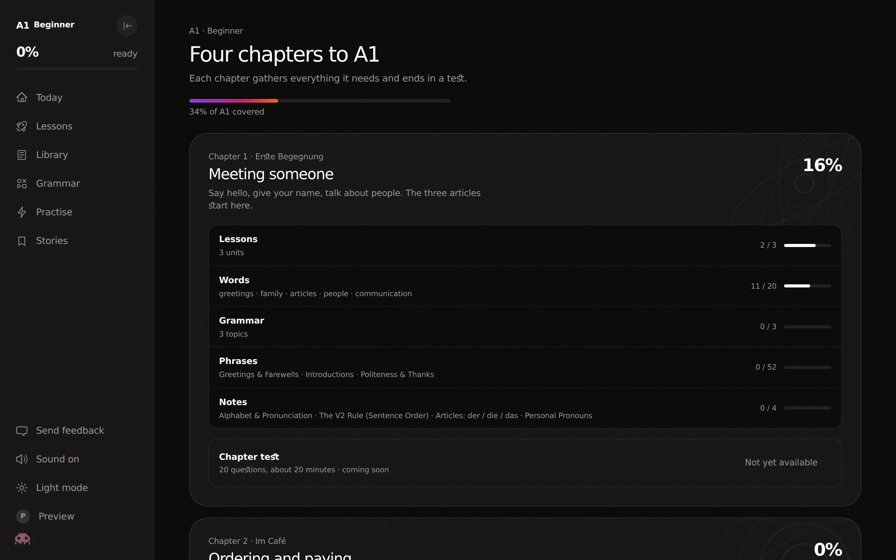
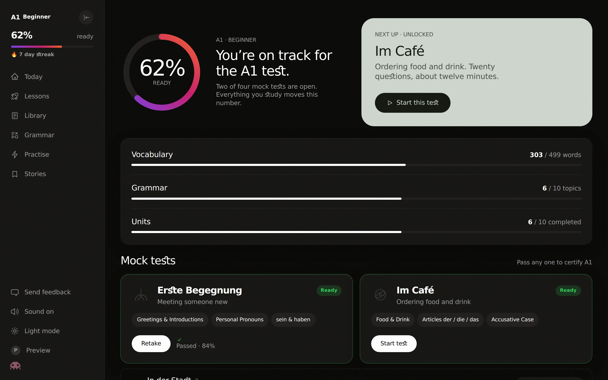
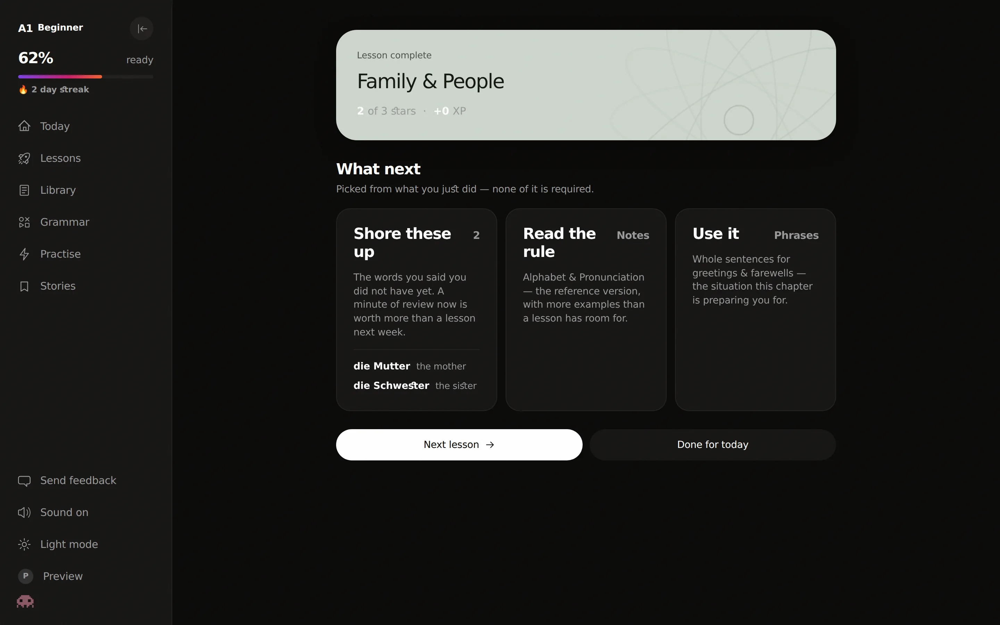
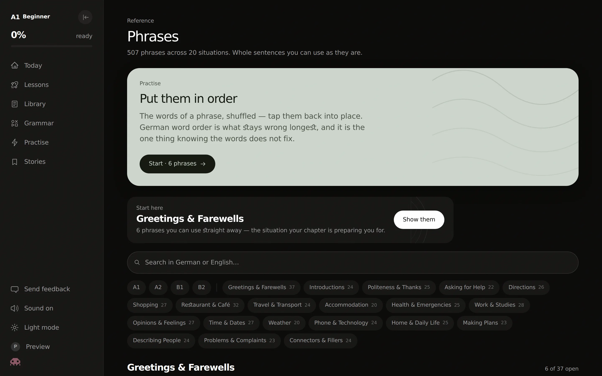
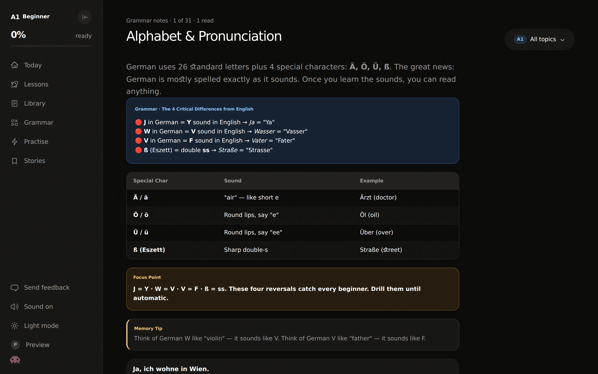
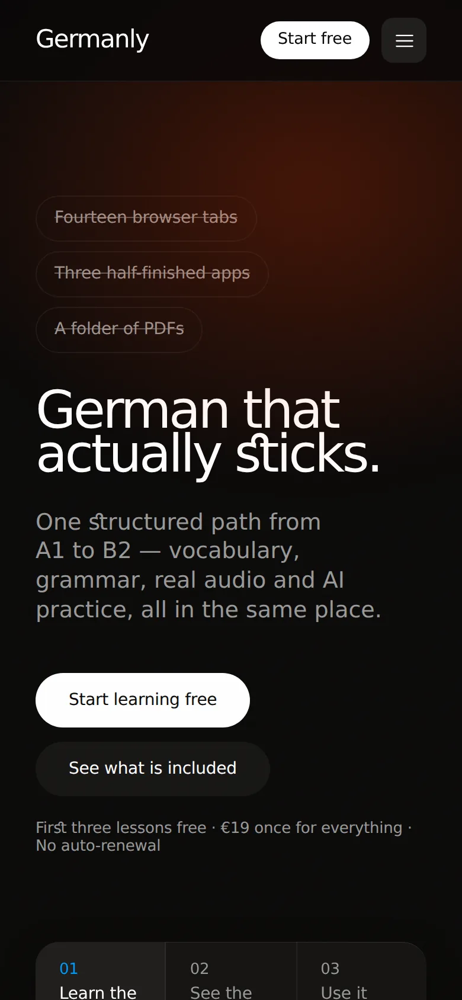
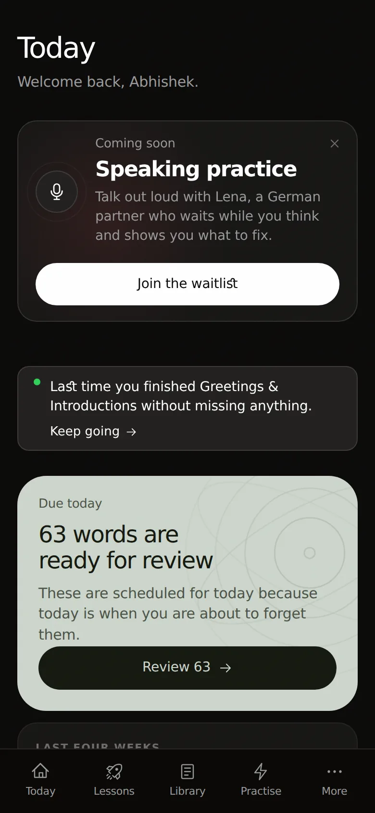

## 10. Team

> Note to self: add who joined you. How many people helped (content, testing, feedback, development), what each person did, and how you found them. Also add the early users who gave written feedback.

## 11. What I learned

1. **Being the user is a head start, not a substitute for research.** My first plan (a C2 subscription) was built on my own assumptions. Talking to learners cut the scope in half and changed the business model.
2. **Measure the interface, don't just look at it.** Counting controls and primary actions turned "it feels messy" into a fix I could prioritise in a day.
3. **Premium is responsiveness and restraint, not decoration.** The fix for "cheap packaging" was not more animation, it was one clear action and an answer to every tap.
4. **Honest pricing is a design decision.** "€19 once, no auto renewal" did more for trust than any visual polish.
5. **Ship, then listen.** The most important insight in this project (the packaging problem) only appeared after real people used the real product.

## 12. What is next

* **Speaking practice with Lena**, a German partner who waits while you think and shows you what to fix (waitlist live)
* **Funnel instrumentation** from signup to first finished lesson, to replace guesswork with evidence
* **Hear it, then say it** practice for the ten sounds English speakers get wrong
* Returning to the same learner communities once the new first thirty seconds are proven
